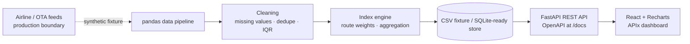

# APIx — Real-time Airfare Price Index

[](https://github.com/risheekmahesh/AIR-FARE-INDEX/actions/workflows/ci.yml)

APIx is a Smart India Hackathon 2026 prototype for the Ministry of Statistics and Programme Implementation (MoSPI). It demonstrates how a transparent, automated airfare index can complement CPI collection by measuring dynamic route-specific prices across Indian domestic sectors and advance-purchase windows.

> **Important data disclosure:** every fare shown in this repository is realistic synthetic/sample data generated locally. It stands in for a production pipeline that would ingest approved airline and OTA feeds; no live scraping is performed.

## What the demo does

- Generates 75 days × 6 routes × 5 lead-time windows × 5 airlines of plausible fare observations.
- Cleans observations with missing-value handling, deduplication, and IQR outlier removal.
- Computes a route-weighted APIx index with daily, weekly, monthly, per-route, lead-time, airline, and heatmap views.
- Exposes a documented FastAPI REST API and a responsive React data-viz dashboard.

## Architecture



## Repository layout

```text
backend/app/       FastAPI app, models, cleaning, data generator, indexer
backend/tests/     pytest tests for the data pipeline
frontend/          Vite React dashboard with custom CSS visual system
data/sample/       committed synthetic fare fixture generated by seed.py
docs/              methodology and formula notes
.github/workflows/ CI test + lint workflow
```

## Local setup

### 1. Backend

```bash
cd backend
python3 -m venv .venv
source .venv/bin/activate
pip install -r requirements.txt
python seed.py
uvicorn app.main:app --reload --port 8000
```

OpenAPI documentation: [http://localhost:8000/docs](http://localhost:8000/docs)

### 2. Frontend

In another terminal:

```bash
cd frontend
npm install
npm run dev
```

Open the Vite URL printed in the terminal, normally [http://localhost:5173](http://localhost:5173).

### 3. Tests and lint

```bash
cd backend
pytest -q
ruff check app tests
```

## API reference

| Endpoint | Purpose |
|---|---|
| `GET /api/index/daily` | Daily basket-weighted APIx values |
| `GET /api/index/weekly` | Weekly aggregated values |
| `GET /api/index/monthly` | Monthly aggregated values |
| `GET /api/index/route/{origin}/{destination}` | Route-specific index trend |
| `GET /api/index/lead-time` | Average fare by T+1/T+7/T+15/T+30/T+45 |
| `GET /api/index/airlines` | Airline component breakdown |
| `GET /api/index/heatmap` | Route × date fare matrix |
| `GET /api/routes` | Basket metadata and fixed weights |
| `GET /api/fares/raw` | Paginated cleaned records; supports `route`, `airline`, `advance_window`, and `date` filters |

## Index methodology

The index is normalized to a route-specific median fare of 100. For route `r` and period `t`, the route sub-index is:

`I(r,t) = mean(total_fare(r,t)) / median(total_fare(r, all periods)) × 100`

The overall APIx value is a weighted average of route sub-indices:

`APIx(t) = Σ [w(r) × I(r,t)] / Σ w(r)`

Weights are fixed configuration values chosen to mirror relative passenger-traffic proportions across major domestic sectors, inspired by DGCA traffic reporting. They are explicitly configuration, not a claim of an official MoSPI weight. See [`docs/methodology.md`](docs/methodology.md).

## Routes, windows, airlines

The demo basket is DEL-BOM, DEL-BLR, BOM-BLR, DEL-CCU, BLR-HYD, and MAA-DEL. Each route is generated at T+1, T+7, T+15, T+30, and T+45 days for IndiGo, Air India, Air India Express, Akasa Air, and SpiceJet. Fare records include base fare, taxes, UDF, convenience fee, total fare, source, booking/travel date, fare class, and collection timestamp.

## Production path

A deployable next step would replace the CSV fixture with a governed ingestion service, source-level schema validation, persistent PostgreSQL storage, freshness monitoring, route-level sample-size thresholds, official traffic weights, and a documented revision policy. The API and frontend contracts are already separated around that boundary.

## Impact

APIx improves the potential accuracy of the CPI Transport and Communication sub-group by measuring dynamic online fares across a defined city-pair basket, airlines, and advance-purchase windows instead of relying only on manual or limited-outlet collection. Its route-level weighting and `/api/index/lead-time` elasticity endpoint preserve the differences between sectors and booking horizons, giving RBI more granular, higher-frequency inputs for monitoring inflation dynamics and monetary-policy conditions than a lagging monthly average alone. For NSO/MoSPI, the FastAPI endpoints expose the cleaned fare records, route metadata, and daily/weekly/monthly index outputs in an auditable, API-consumable form. The committed synthetic fixture, cleaning tests, and documented index methodology make each transformation reproducible while keeping the production data-ingestion boundary explicit.
